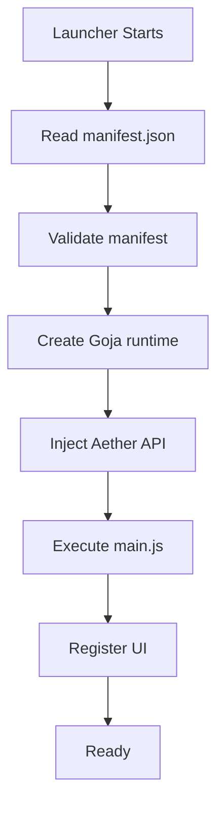

# Extension API & Sandbox

Aether executes extension backend scripts inside an isolated **Goja JavaScript runtime**. 

> [!WARNING]
> This backend environment is **NOT** a browser or a Node.js environment. The following APIs are unavailable:
> - `window`
> - `document`
> - `fetch` (unless explicitly provided via `Aether.http.get`)
> - `localStorage`
> - `require()`
> - `process`, `fs`, `child_process` (and all other Node.js modules)

Instead, your script interacts with the launcher core via the injected `Aether` global object.

## The `Aether` Global Object

When your extension's `main.js` is executed, the `Aether` object is injected into the global scope. The capabilities attached to this object depend strictly on the permissions requested in your `manifest.json`.

### UI Registration (`ui:sidebar`)
Allows the extension to register a frontend UI tab.

- `Aether.ui.registerSidebarPage(options)`
  - **options** (Object):
    - `id` (String): A unique identifier for the tab.
    - `label` (String): The text displayed on the tab.
    - `url` (String): The path to your UI HTML file, relative to your extension's root directory (e.g., `"ui/index.html"`).

### Dialogs (`ui:dialogs`)
The capability is present for compatibility, but `Aether.ui.openDialog()` is currently a stub and does not open a launcher dialog yet.

### Instance and Mod Management
`instances:list` allows the extension to query instances. The separate `mods:list`, `mods:install`, `mods:delete`, and `mods:toggle` permissions control access to files in their `mods` directories. Sensitive mod operations require confirmation in the launcher UI.

- `Aether.instances.list()`
  - Returns an array of objects representing all installed instances: `[{ id, name, version, loader }]`.
- `Aether.instances.installMod(instanceId, jarName, downloadURL)`
  - **instanceId** (String): The ID of the instance to modify.
  - **jarName** (String): The filename to save the mod as (e.g. `fabric-api.jar`).
  - **downloadURL** (String): The URL to download the mod from (must be allowed in `hosts`).
- `Aether.instances.listMods(instanceId)`
  - **instanceId** (String): The ID of the instance.
  - Returns an array of strings representing the filenames in the `mods` folder.
- `Aether.instances.deleteMod(instanceId, jarName)`
  - Deletes the specified mod file from the instance.
- `Aether.instances.toggleMod(instanceId, jarName, enable)`
  - **enable** (Boolean): True to enable, false to disable.
  - Disabling a mod renames it to `.jar.disabled`. Enabling it renames it back to `.jar`.

### Worlds and Quick Launch (`saves:list`, `instances:launch`)
- `Aether.instances.listWorlds(instanceId)` (requires `saves:list`)
  - Returns singleplayer worlds from the instance's `saves/` folder: `[{ id, name, lastPlayed, gameMode }]`, most recently played first. `name` comes from `level.dat`; worlds with an unreadable `level.dat` still appear under their folder name.
- `Aether.instances.launchToServer(instanceId, host, port)` (requires `instances:launch`)
  - Launches the game and auto-connects via the vanilla `--server`/`--port` flags (all versions). Hosts must not contain whitespace or start with `-`; ports are clamped to 1–65535.
- `Aether.instances.launchToWorld(instanceId, world)` (requires `instances:launch`)
  - Launches the game and auto-loads a singleplayer world via Mojang Quick Play (`--quickPlaySingleplayer`). Requires Minecraft 1.20+; older instances return an error. `world` is the saves folder name, confined to `saves/` (traversal rejected) and must contain a `level.dat`.

### Mod Loader Registration (`launcher:modloader`)
Allows the extension to register a custom mod loader that Aether can use to launch instances.

- `Aether.launcher.registerModLoader(config)`
  - **config** (Object):
    - `id` (String): A unique identifier for the loader.
    - `name` (String): The display name of the loader.
    - `description` (String): A brief description of the loader.
    - `onLaunch` (Function): A callback executed when an instance with this loader is launched.

### Skin Management (`skin:export`)
Allows the extension to write base64 encoded skins to the local filesystem.

- `Aether.skins.export(base64Data, filename)`
  - **base64Data** (String): The skin image encoded as a base64 string.
  - **filename** (String): The name to save the skin as (e.g., `skin.png`). Returns the saved file path.

## Network Access
By default, the backend Sandbox cannot access the network. To make requests, you must request `network:http` in your permissions and use the provided `Aether.http.get(url)` API. Backend extension requests require HTTPS, an allowed hostname, and are limited to 10 MiB responses.
Direct browser `fetch()` is unavailable in the backend sandbox. The provided HTTP API applies host allow-listing; logging and rate limiting are not currently implemented.

*Note: An extension's frontend iframe can use the browser's normal `fetch()` behavior. That request is separate from the backend sandbox API and is not covered by the backend host allow-list.*

## File System Access
By default, the backend Sandbox cannot download arbitrary files.
- `Aether.fs.download(url, dest)` (requires `fs:download` permission)
  - Downloads a file from the given URL (must be allowed in `hosts`) into Aether's shared `libraries` directory. This capability also requires HTTPS; mod installation additionally requires a `.jar` file of at most 100 MiB.

## Communication with the Frontend (Iframe)
Your frontend UI runs in an `<iframe>` served by a local HTTP server. Because it's isolated, it cannot call the `Aether` Go API directly.

To communicate between your UI and the backend Goja sandbox, use the built-in IPC bridge.

### 1. In your Backend Script (`main.js`)
You can register a listener using `Aether.ui.onMessage`. Any data returned by this function is automatically sent back to the frontend UI as a response. You can also push messages down to the frontend UI without a prompt using `Aether.ui.postMessage`.

```javascript
// Listen for messages from the frontend
Aether.ui.onMessage((payload) => {
    if (payload.action === 'download_mod') {
        const path = Aether.instances.installMod(payload.instanceId, payload.jarName, payload.url);
        return { status: 'success', path: path }; // Sent back to frontend
    }
});

// Push a message to the frontend unconditionally
Aether.ui.postMessage({ type: 'download_progress', percent: 50 });
```

### 2. In your Frontend UI (`index.html`)
Because the frontend runs in an isolated `<iframe>`, you use standard Web APIs (`window.postMessage`) to talk to the bridge, and listen for responses via `window.addEventListener('message')`.

```javascript
// Send a message to your backend script. Every request carries an
// incrementing requestId; responses echo it back for correlation.
let requestId = 0;
const pending = {};
window.parent.postMessage({
    type: 'download_mod',
    requestId: ++requestId,
    instanceId: 'fabric-1.20',
    jarName: 'my-mod.jar',
    url: 'https://example.com/mod.jar',
    // targetOrigin is "*" on purpose: window.location is the iframe's own
    // origin while window.parent is the Wails webview, so a computed
    // origin never matches and messages are silently dropped.
    // requestId correlation is the actual boundary.
}, '*');

// Listen for responses or pushed messages from the backend script.
// Backend payloads are forwarded as-is (no marker) — match ONLY on
// requestId, or every reply is dropped.
window.addEventListener('message', (event) => {
    const msg = event.data;
    if (!msg || msg.requestId == null || !pending[msg.requestId]) return;
    if (event.data.status === 'success') {
        console.log("Mod downloaded to: ", event.data.path);
    }
});
```

## Lifecycle



### Lifecycle Callbacks (Planned)
Future API versions will introduce explicit lifecycle callbacks so your extension can run setup or cleanup logic predictively:
- `onLoad()`
- `onEnable()`
- `onDisable()`
- `onUnload()`
- `onUpdate()`

## Events
Extensions can subscribe to core launcher events (requires `discord:presence` or `instances:list`):

- `Aether.events.on('instance:state', (evt) => { ... })`
  - `evt` is `{ id: string, state: "Running" | "Stopped" | "Crashed" }` – fired when a game process starts/stops.
  - Example for Rich Presence:
    ```js
    Aether.events.on('instance:state', (e) => {
      if (e.state === 'Running') {
        const inst = Aether.instances.list().find(i => i.id === e.id);
        Aether.discord.setActivity({
          details: inst.name,
          state: `${inst.version} \u2022 ${inst.loader}`,
          largeImageKey: "aether-logo",
          smallImageKey: inst.loader,
          startTimestamp: Date.now()
        });
      } else {
        Aether.discord.clearActivity();
      }
    });
    ```
  - `Aether.events.off('instance:state')` removes all handlers for the event.

### Discord Rich Presence (`discord:presence`)
Requires `discord:presence` permission. Works only if Discord desktop is running.

- `Aether.discord.setActivity(opts)`
  - `opts`: `{ details, state, largeImageKey, largeText, smallImageKey, smallText, startTimestamp }`
  - `startTimestamp` is milliseconds since epoch (`Date.now()`).
- `Aether.discord.clearActivity()` – back to Idle.

Legacy planned names `instance:launch`/`instance:stop` remain supported as aliases for `instance:state` with `Running`/`Stopped`.

## Multiplayer Servers (`servers:list`, `servers:manage`)

Extensions can read the multiplayer server list and manage extension-owned
server directories. Server hosting processes (`start`/`stop`) are a planned
v2 addition and are not available yet.

Requires `servers:list` and/or `servers:manage`.

- `Aether.servers.list(instanceId)`
  - Returns the instance's `servers.dat` entries: `[{ name, ip, hidden, hasIcon }]`.
- `Aether.servers.ping(hostport)`
  - Pings a server (`"mc.example.com"` or `"mc.example.com:25566"`, default port 25565) using the status protocol.
  - Returns `{ online, host, port, motd, playersOnline, playersMax, version, protocol, latencyMs }`.
  - Unreachable servers yield `{ online: false }`, not an error. Only malformed input throws.
  - Gated on `servers:list` because targets are user-entered — the `network:http` host allow-list cannot apply.
- `Aether.servers.listWithStatus(instanceId, timeoutMs?)`
  - Bulk list: `servers.dat` entries with live status attached — `[{ name, ip, hidden, online, host, port, motd, playersOnline, playersMax, version, latencyMs }]`.
  - Pings run concurrently in Go (max 6) with a per-server budget (`timeoutMs`, default 3000, clamped 500–10000), so one dead server can't stall the list.
  - Results are cached per `servers.dat` content (mtime+size, 45 s TTL): revisits are instant, in-game edits invalidate immediately.
  - Prefer this over `list()`+`ping()` loops — the sandbox is single-threaded and sequential pings take seconds per dead server.

All struct shapes crossing the bridge expose lowercase `json` names (`row.name`, never `row.Name`) — guaranteed by the sandbox field mapper and pinned by `TestSandboxStructKeysUseJSONTags`.
- `Aether.servers.create(id, name?)`
  - Creates `servers/<id>/` with a starter `server.properties`. Returns `{ id, name }`.
- `Aether.servers.listServers()`
  - Returns `[{ id, name }]` for every managed server directory.
- `Aether.servers.delete(instanceId)`
  - Deletes `servers/<id>/` after the standard user confirmation.
- `Aether.servers.readFile(instanceId, relpath)`
  - Returns a text file inside `servers/<id>/` as UTF-8 (5 MiB cap).
- `Aether.servers.writeFile(instanceId, relpath, base64Data)`
  - Writes base64 content inside `servers/<id>/` (5 MiB cap, atomic write).

Paths stay inside `servers/<id>/` (traversal rejected), and single files are
capped at 5 MiB.

### Server Processes (`servers:process`)
Supervised game-server processes (Paper/Purpur/vanilla jars). The launcher
owns the child process: extensions can start, stop, query, and send console
input, but never receive handles, PIDs for reuse, or shell access. Output
streams into `server:log` events; transitions emit `server:state`.

- `Aether.servers.start(id, opts?)`
  - `opts`: `{ mcVersion?, memoryMB?, jarName?, extraArgs?[] }`. Memory defaults
    to 2048, clamped to 512–16384. `jarName` defaults to auto-detect
    (`paper-*.jar`, `purpur-*.jar`, then `server.jar`). `mcVersion` defaults
    to detection from the jar filename.
  - Fails with an EULA error when `eula.txt` is not accepted — show a
    confirmation dialog, then call `acceptEula` and retry. Never accept silently.
  - Fails when the server is already running, when 2 servers already run, or
    when the configured port is in use. Requires a compatible Java, which the
    launcher resolves (managed → system → download).
- `Aether.servers.stop(id)` — sends `stop` for graceful shutdown, kills after 10 s.
- `Aether.servers.status(id)` — `{ id, running, pid?, startedAt?, port?, mcVersion? }`.
- `Aether.servers.send(id, command)` — writes a console line to stdin (4 KB cap).
- `Aether.servers.acceptEula(id)` — writes `eula=true`. Call only after explicit user confirmation.
- `Aether.servers.eulaStatus(id)` — `true` when `eula.txt` accepts the EULA.
- `Aether.servers.recentLogs(id, n?)` — last buffered log lines, newest last.

## API Version Negotiation
Extensions may declare an `api` version in their manifest. The current launcher does not negotiate API versions or enforce `minApi` and `maxApi` ranges; those fields are planned compatibility metadata.

## Extended Permissions Model

Current permissions recognized by the runtime:
- `ui:sidebar`
- `ui:dialogs` (stub only)
- `instances:list`
- `mods:list`
- `mods:install`
- `mods:delete`
- `mods:toggle`
- `network:http`
- `fs:download`
- `launcher:modloader`
- `skin:export`
- `discord:presence`
- `servers:list`
- `servers:manage`
- `servers:process`
- `saves:list`
- `instances:launch`

The legacy `instances:patch` permission is still recognized for migration and grants the current instance/mod capabilities. New extensions should use the granular permissions above.

Confirmation requests and decisions are recorded in Aether's extension security log.

Future granular permissions:
- `instances:read`, `instances:write`
- `settings:read`, `settings:write`
- `launcher:launch`, `launcher:stop`
- `downloads:start`, `downloads:cancel`
- `notifications:show`
- `clipboard:read`, `clipboard:write`
- `extensions:list`
