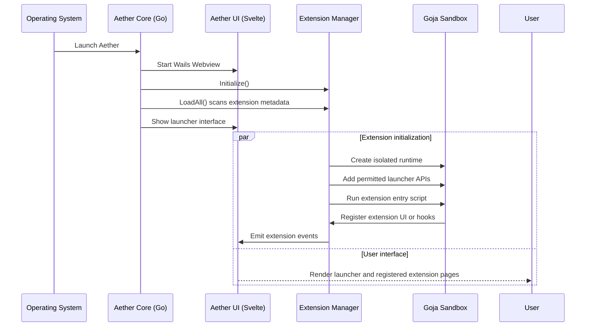
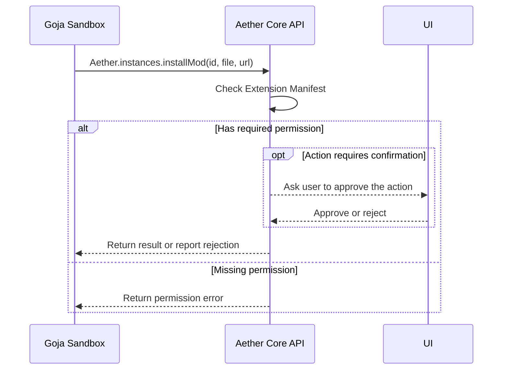

# Architecture

## Application structure
Aether runs a Svelte interface in a Wails desktop window, backed by Go. Go handles game files, accounts, Java, extensions, and managed processes. The frontend calls those services through generated Wails bindings, and backend events keep the interface up to date with progress and state changes.

## Go Packages
- `main.go` and `app_*.go`: Wails startup and frontend-facing application methods, split by feature.
- `pkg/instance`: Instance management, dependency resolution, imports, and Minecraft launch arguments.
- `pkg/java`: Java discovery, installation, and process support.
- `pkg/auth`: Account storage and Microsoft and offline authentication.
- `pkg/extensions`: Extension discovery, installation, APIs, and sandbox runtime.
- `pkg/theme`: Theme installation, validation, and asset serving.
- `frontend/src`: Svelte pages, shared components, stores, and styles.

## Extension Manager
The Extension Manager (`pkg/extensions`) discovers, installs, and runs extensions. Each backend script gets its own Goja runtime and only the launcher APIs granted by its manifest permissions. The launcher can ask the user before sensitive actions. Extensions do not get unrestricted access to the host operating system; see [Security](SECURITY.md) for the limits of this protection.

## Updates
The launcher checks for releases and can offer an update in the interface. Users can enable an automatic check after startup in Settings, or check manually. Extension updates are managed from the Extensions page. Release handling and platform-specific installation live in `pkg/update` and the frontend bindings.

## Launcher Pipeline
1. **Resolve** the selected instance version, mod loader, libraries, and assets.
2. **Prepare** missing game files and locate or install a compatible Java runtime.
3. **Authenticate** with the selected account and build the launch session.
4. **Run extension hooks** where a loader extension supplies launch configuration.
5. **Launch Minecraft** with the resolved Java command and instance settings.
6. **Report state** by sending process status and log events to the frontend.

## Diagrams

### Launcher Startup & Extension Loading

### Permission Validation

